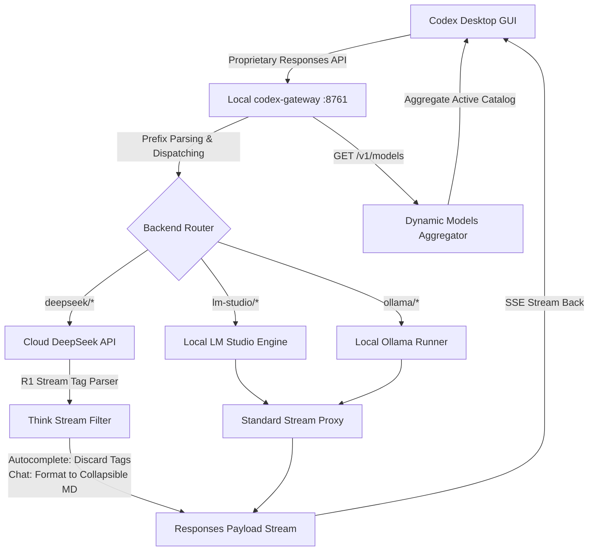
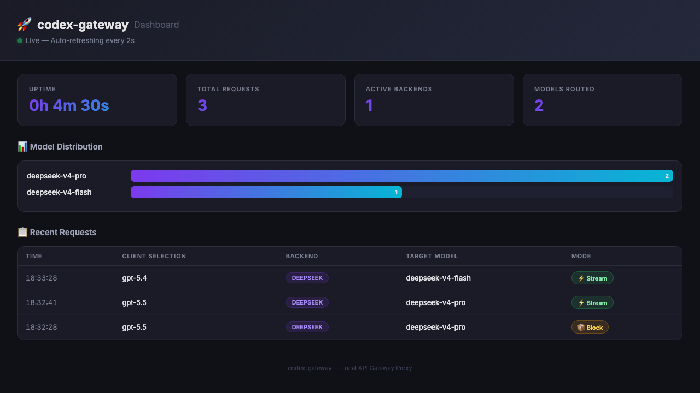

# codex-gateway 🚀

[](https://github.com/aihank6674/codex-gateway)
[](https://www.python.org/)
[](https://fastapi.tiangolo.com/)
[](LICENSE)

A self-contained, light-speed local API gateway that bridges **OpenAI's Codex Desktop** application with **Cloud DeepSeek APIs** and standard **local OpenAI-compatible model runners** (LM Studio, Ollama, vLLM, llama.cpp, etc.). 

By translating proprietary Codex "Responses API" payloads into standard "Chat Completions" REST endpoints, `codex-gateway` provides a unified portal to run cloud reasoning models and local code-completion engines simultaneously inside your Codex GUI.

---

## 🎨 Dual-Channel Architecture



---

## ✨ Key Features

*   **☁️ Cloud & 🏠 Local Hybrid Routing**: Effortlessly toggle between full-scale cloud models (`deepseek-v4-flash`, `deepseek-v4-pro`) and local private completion engines (Qwen2.5-Coder, Llama-3) directly in the Codex Desktop dropdown without restarting.
*   **🔍 Dynamic Model Catalog Aggregation**: On startup, the gateway concurrently queries all enabled local backends, merges active models with your DeepSeek cloud roster, and dynamically generates Codex's `model-catalog.json` for UI rendering.
*   **🧠 DeepSeek-R1 Stream Beautifier**: Automatically parses R1's `<think>...</think>` tags on the fly:
    *   *Code Autocomplete*: Completely discards the thinking text to prevent editor parser failures.
    *   *Agent Chat*: Beautifies the thinking stream into clean, collapsible Markdown blocks so you can follow the model's reasoning without cluttering the canvas.
*   **🔄 Safe Profile Injection & Chat History Migration**: Safe, idempotent config patching for `~/.codex/config.toml` that backs up your environment on launch and completely restores it upon application exit. It automatically migrates SQLite chat histories (`state_*.sqlite`) between `openai` and `codex-gateway` model providers so you never lose context or visibility of past threads.
*   **🛡️ Lifecycle Daemon & Signal Trap**: A robust execution wrapper script (`gateway.sh`) handles setting up an isolated virtual Python environment, launching the proxy server, waking up Codex, and capturing `INT`, `TERM`, and `HUP` signals (e.g. terminal window closes) to guarantee a clean restore and rollback.
*   **📊 Live Web Dashboard**: A built-in real-time monitoring dashboard to track request volume, latency distribution, backend routing splits, and live SSE streaming logs.

---

## 🎭 UI Limitations & Model Mapping (Important!)

Due to internal design choices in the official Codex Desktop application (specifically its proprietary `responses` API), **the model selection dropdown in the Codex UI is strictly hardcoded to official GPT models**. Codex Desktop will actively ignore custom models in `model_catalog_json` for dropdown rendering and force the display of models like `GPT-5.5` and `GPT-5.4-Mini`.

Because we cannot natively inject custom dropdown menus into the closed-source Codex client without losing advanced features, `codex-gateway` utilizes a silent **dynamic fallback routing mapping** based on request model tiers:

| UI Selection (The "Mask") | Backend Routing (The "Reality") | Target Tier / Fallback Behavior |
| :--- | :--- | :--- |
| **`GPT-5.5`** | **`deepseek-v4-pro`** (or default heavy reasoning models) | High-Tier / Heavy Reasoning |
| **`GPT-5.4` / `GPT-5.4-Mini`** | **`deepseek-v4-flash`** (or models matching flash/mini keywords) | Low-Tier / Fast Autocomplete |

### Dynamic Fallback Logic
When a standard GPT request from Codex UI enters the gateway:
*   **Low-Tier Request** (e.g. `GPT-5.4`, `mini`, `flash`, `lite`): The gateway dynamically searches the model catalog and routes to the first model matching flash keywords (`mini`, `flash`, `lite`, `fast`, `coder`, `qwen`). If none are found, it falls back to the first catalog model (typically `deepseek-v4-flash`).
*   **High-Tier Request** (e.g. `GPT-5.5`): The gateway routes to the first reasoning model in the catalog (typically `deepseek-v4-pro`).

---

## 🚀 Quick Start

### 1. Prerequisites
Ensure you have **Python 3** and **Codex Desktop** installed on your macOS machine.

### 2. Setup Configuration
Clone the repository, copy the environment template, and insert your DeepSeek API Key:
```bash
git clone https://github.com/aihank6674/codex-gateway.git
cd codex-gateway

# Copy template configuration
cp gateway.env.example gateway.env

# Open and add your DeepSeek API Key
nano gateway.env
```

### 3. Run the Launcher
Simply start the gateway orchestrator:
```bash
./gateway.sh
```
*The script will automatically set up its own isolated virtual environment (`.venv`), patch your profile, launch the proxy server, and wake up Codex Desktop!*

---

## 📊 Real-Time Monitoring Dashboard

The gateway includes a built-in real-time monitoring web dashboard. It auto-refreshes every 2 seconds to give you complete visibility into the proxy's operations.

*   **Access URL**: Open [http://localhost:8000/](http://localhost:8000/) (or your configured `GATEWAY_PORT`) in any browser.
*   **Monitored Metrics**:
    *   **Uptime**: Active running duration of the proxy server.
    *   **Total Requests**: Accumulated request count processed since launch.
    *   **Active Backends**: Count of configured model backends (Cloud DeepSeek, Ollama, LM Studio, etc.).
    *   **Model Distribution**: Dynamic bar charts showing routing percentages.
    *   **Live Requests Log**: A tabular view of recent requests, indicating client selection, routed backend, target model, and event mode (⚡ Stream vs 📦 Block).



---

## ⚙️ Configuration Parameters (`gateway.env`)

Configure gateways dynamically to aggregate cloud and local endpoints:

| Variable | Default Value | Description |
| :--- | :--- | :--- |
| `GATEWAY_PORT` | `8000` | Local gateway proxy execution port. |
| `ENABLE_DEEPSEEK` | `true` | Set to true to activate Cloud DeepSeek routes. |
| `DEEPSEEK_API_KEY` | `""` | Your official DeepSeek API credentials. |
| `DEEPSEEK_MODELS` | `deepseek-v4-flash,deepseek-v4-pro` | Comma-separated cloud models to expose. |
| `ENABLE_LOCAL_A` | `false` | Enable/Disable local runner A (e.g. LM Studio, vLLM). |
| `LOCAL_A_NAME` | `"lm-studio"` | Model ID prefix for backend A (e.g. `lm-studio/model-id`). |
| `LOCAL_A_BASE_URL` | `"http://localhost:1234/v1"` | Port address where backend A is running. |
| `ENABLE_LOCAL_B` | `false` | Enable/Disable local runner B (e.g. Ollama). |
| `LOCAL_B_NAME` | `"ollama"` | Model ID prefix for backend B. |
| `LOCAL_B_BASE_URL` | `"http://localhost:11434/v1"` | Port address where backend B is running. |

---

## 🧪 Developer & TDD Testing

`codex-gateway` is designed with strict Test-Driven Development (TDD). You can run the entire test suite locally within the virtual environment:

```bash
# Setup virtual environment and dependencies (if not done by gateway.sh)
python3 -m venv .venv
source .venv/bin/activate
pip install -r requirements.txt

# Run the pytest suite
pytest tests/ -v
```

### Passing Tests Output:
```text
tests/test_configurator.py::test_patch_and_rollback PASSED               [  8%]
tests/test_configurator.py::test_migrate_existing_threads PASSED         [ 16%]
tests/test_dashboard_e2e.py::test_stats_api PASSED                       [ 25%]
tests/test_dashboard_e2e.py::test_dashboard_page PASSED                  [ 33%]
tests/test_dashboard_e2e.py::test_models_endpoint PASSED                 [ 41%]
tests/test_parser.py::test_request_payload_transformation PASSED         [ 50%]
tests/test_parser.py::test_chunk_response_transformation PASSED          [ 58%]
tests/test_parser.py::test_full_response_transformation PASSED           [ 66%]
tests/test_parser.py::test_request_input_array_transformation PASSED     [ 75%]
tests/test_think_handler.py::test_discard_think_blocks PASSED            [ 83%]
tests/test_think_handler.py::test_format_think_blocks PASSED             [ 91%]
tests/test_think_handler.py::test_partial_tag_buffering PASSED           [100%]

============================== 12 passed in 4.93s ==============================
```

---

## 📄 License
Distributed under the MIT License. See `LICENSE` for more information.
